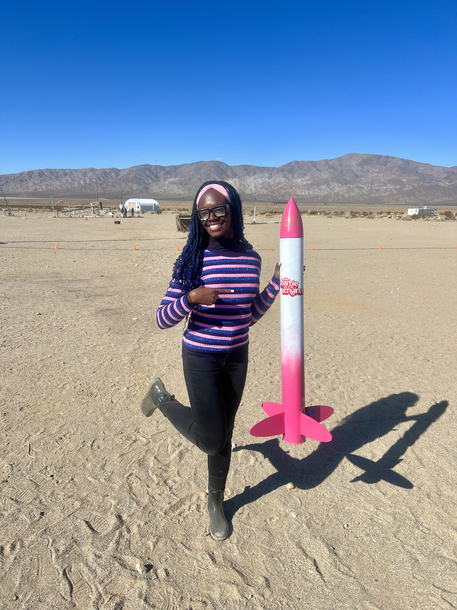
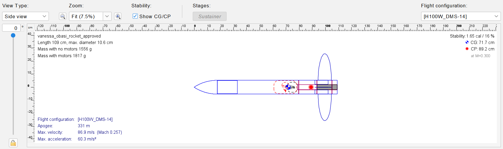
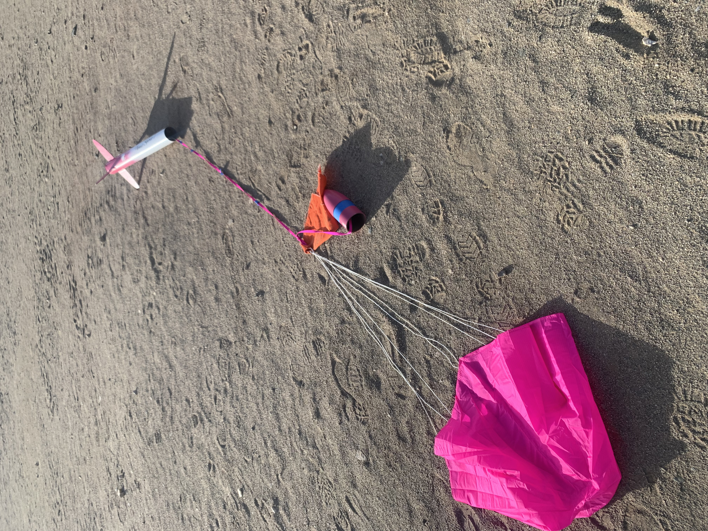

# 🚀 Venus Spirit 1

A high-power model rocket designed and flight-simulated in OpenRocket, with a custom nose cone and elliptical fins 3D-modeled in Onshape.



## Project Overview

Venus Spirit 1 is a high-power model rocket project that combined rocket design, flight simulation, 3D modeling, fabrication, and flight testing.

The project progressed from an initial OpenRocket design and simulation to physical fabrication and two launch attempts. The first flight used an H100W motor, followed by a second flight using an I161W motor for my Level 1 certification flight. The second flight reached approximately 1,200 ft and was successfully recovered.

### Project Name

**Venus Spirit 1**

- **Venus** represents femininity in Roman mythology.
- **Spirit** represents taking flight.
- **1** represents the first version of the design.

---

## 🧩 Design & Modeling

### OpenRocket

OpenRocket was used to design the overall rocket configuration and simulate its flight characteristics.

The initial H100W flight configuration produced the following simulation results:

| Parameter | Simulated Result |
|---|---:|
| Stability | 1.65 calibers |
| Length | 109 cm |
| Maximum Diameter | 10.6 cm |
| Apogee | 331 m (~1,086 ft) |
| Maximum Velocity | 86.9 m/s |
| Maximum Acceleration | 60.3 m/s² |
| Motor | H100W |



### Onshape

Onshape was used to 3D-model custom rocket components, including the:

- Nose cone
- Elliptical fins

These components were then fabricated and incorporated into the physical rocket.

---

## 🔧 Fabrication

The rocket was physically constructed and finished after completing the design and modeling stages.

Fabrication included:

- 3D-printed nose cone
- 3D-printed elliptical fins
- Rocket body assembly
- Fin attachment and alignment
- Surface finishing and painting


---

## 🚀 Flight Testing

Venus Spirit 1 completed two launches as part of the testing and certification process.

### First Test Flight — H100W

The first launch used an **H100W motor** and served as the initial flight test of the completed rocket.

This flight provided an opportunity to evaluate the physical rocket against its OpenRocket simulation before the certification flight.

[▶️ Watch First Test Flight](videos/first-test-flight.mov)

---

### Level 1 Certification Flight — I161W

For the second launch, the rocket was flown with an **I161W motor**.

The stronger motor configuration produced a higher-performance flight, reaching approximately **1,200 ft apogee**. The rocket successfully completed the flight and was recovered, resulting in my **Level 1 High Power Rocketry certification**.

[▶️ Watch Level 1 Certification Flight](videos/level-1-certification-flight.mp4)

---

## 🪂 Recovery

The rocket successfully deployed its parachute recovery system during flight and was recovered after landing.




---

## 📊 Project Results

- **1.65 calibers** of simulated stability
- **331 m (~1,086 ft)** simulated apogee with H100W
- **86.9 m/s** simulated maximum velocity
- **60.3 m/s²** simulated maximum acceleration
- **2 flight tests**
- **~1,200 ft** approximate apogee on Level 1 certification flight
- **Level 1 High Power Rocketry certification**

---

## 🔄 Design Iteration

The two launches provided an opportunity to compare the rocket's simulated performance with real-world flight testing and iterate the motor configuration.

The first flight used an **H100W motor** as the initial test configuration. For the second flight, the motor was changed to an **I161W**, resulting in a higher-performance flight that reached approximately 1,200 ft and successfully completed the Level 1 certification flight.

This process provided hands-on experience connecting simulation, physical fabrication, flight testing, and design iteration.

---

## 💡 Skills & Tools

**Design & Simulation**
- OpenRocket
- Onshape CAD
- Rocket stability analysis
- Flight simulation

**Fabrication**
- 3D printing
- Rocket assembly
- Fin alignment
- Surface finishing

**Testing**
- Flight testing
- Parachute recovery
- Performance comparison
- Iterative motor selection

---

## 📁 Repository Structure

```text
venus-spirit-1/
├── images/
│   ├── venus-spirit-1-final.jpeg
│   ├── venus-spirit-1-openrocket.png
│   ├── venus-spirit-1-front.jpeg
│   ├── venus-spirit-1-back.jpeg
│   ├── venus-spirit-1-fabrication.jpg
│   ├── venus-spirit-flight.jpg
│   └── venus-spirit-1-recovery.jpeg
├── openrocket/
│   └── venus-spirit-1.ork
└── README.md
```

## Author

**Vanessa Obasi**  
Computer Engineering Student | Embedded Systems & Hardware | High-Power Rocketry

[GitHub](https://github.com/vanessaobasi)
