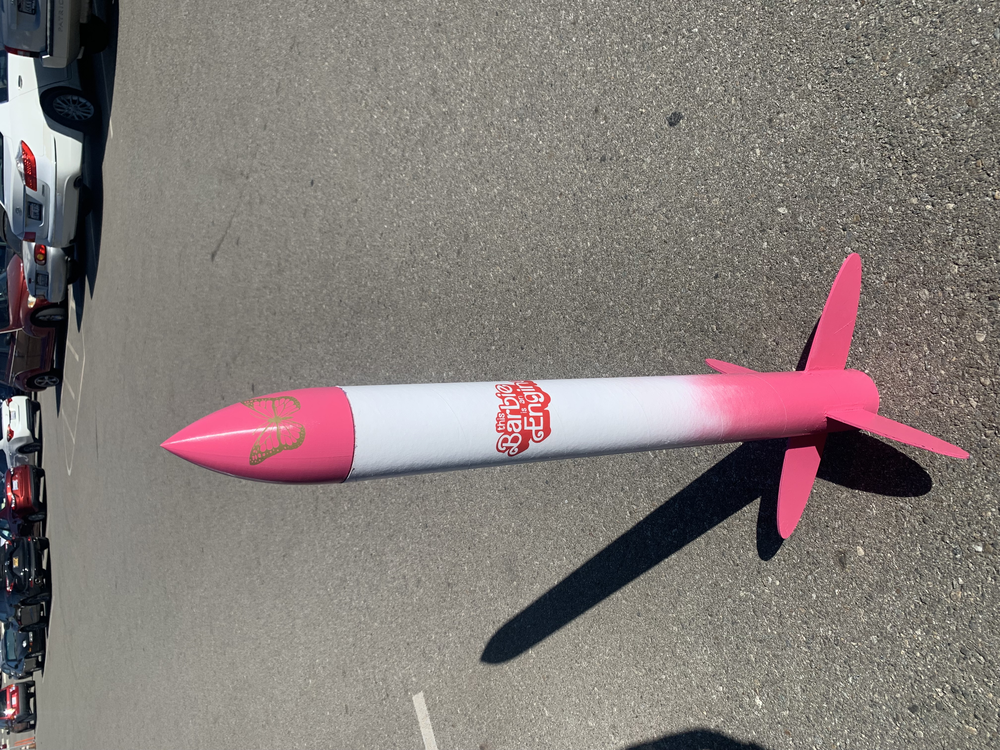
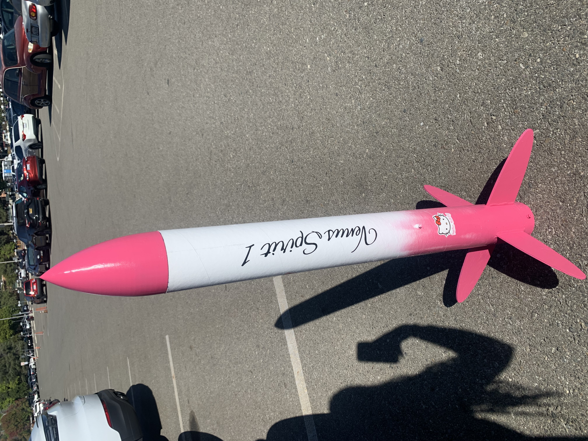
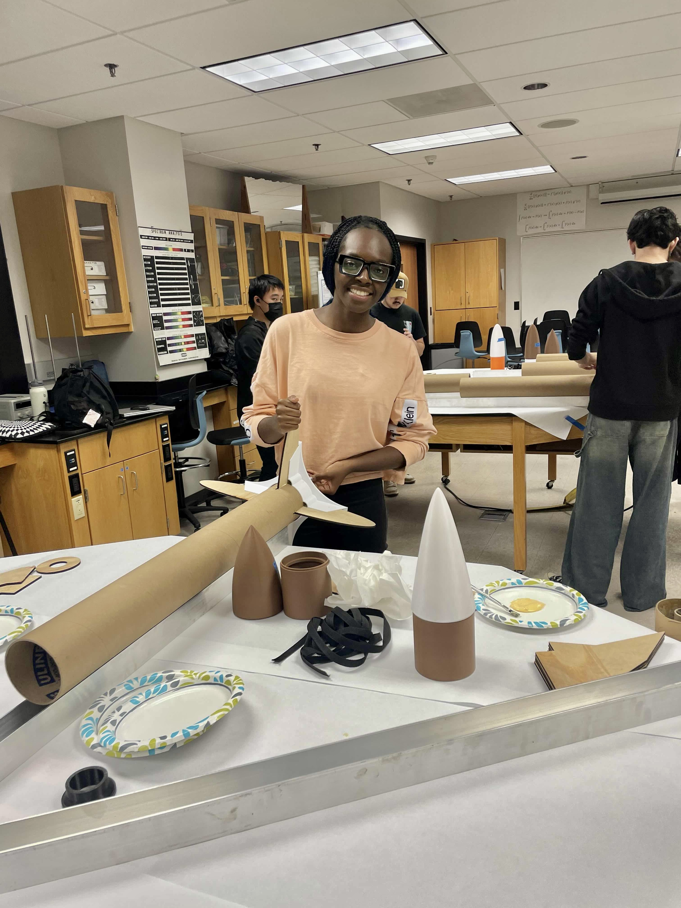

# 🚀 Venus Spirit 1

A high-power model rocket designed and flight-simulated in OpenRocket, with a custom nose cone and elliptical fins 3D-modeled in Onshape.


## Project Overview

Venus Spirit 1 is a high-power model rocket project that combined rocket design, flight simulation, CAD modeling, fabrication, flight testing, and recovery.

The project progressed from an initial OpenRocket design and simulation to physical fabrication and two launches. The first flight served as a test of the completed rocket, while the second incorporated physical improvements and a different motor configuration for the Level 1 certification flight.

### Project Name

**Venus Spirit 1**

- **Venus** represents femininity in Roman mythology.
- **Spirit** represents taking flight.
- **1** represents the first version of the design.

---

## 🧩 Design & Modeling

### OpenRocket

OpenRocket was used to design the overall rocket configuration and simulate its flight characteristics.

The initial configuration used an **AeroTech H100W-14A** motor and produced the following simulation results:

| Parameter | Simulated Result |
|---|---:|
| Stability | 1.65 calibers |
| Length | 109 cm |
| Maximum Diameter | 10.6 cm |
| Apogee | 331 m (~1,086 ft) |
| Maximum Velocity | 86.9 m/s |
| Maximum Acceleration | 60.3 m/s² |
| Motor | AeroTech H100W-14A |

OpenRocket was also used to help determine the appropriate **ejection delay timing** for the recovery system based on the simulated flight.

The original OpenRocket project file is included in this repository so the design and simulation can be reviewed.


### Onshape

Onshape was used to 3D-model custom rocket components, including the:

- Nose cone
- Elliptical fins

These components were then fabricated and incorporated into the physical rocket.

---

## 🎀 Final Design

The finished rocket is sometimes nicknamed the **"Barbie rocket"** because of its pink design and engineering-themed details.

A golden butterfly on the nose cone represents the project's **"Spirit"**, while the **"This Barbie is an Engineer"** decal reflects the engineering theme behind the project.

### Front — "Barbie Rocket"



### Back — Venus Spirit 1



---

## 🔧 Fabrication

The rocket was physically constructed and finished after completing the design and modeling stages.

Fabrication included:

- 3D-printed nose cone
- 3D-printed elliptical fins
- Rocket body assembly
- Laser-cut centering rings attached to the motor tube
- Circular saw used to cut the motor tube
- Fin alignment using a fin alignment jig
- Sandpaper and files used to shape and finish the fins
- Fin attachment and alignment
- Wood glue and epoxy for structural reinforcement
- Surface finishing and painting
- Motor installation and retention
- Recovery-system preparation



---

## 🚀 Flight Testing

Venus Spirit 1 completed two launches as part of the testing and certification process.

### First Test Flight — AeroTech H100W-14A

The first launch used an **AeroTech H100W-14A** motor and served as the initial flight test of the completed rocket.

The H100W-14A has:

| Specification | H100W-14A |
|---|---:|
| Total Impulse | 234 N·s |
| Burn Time | 2.3 s |
| Peak Thrust | 131 N |
| Delay Time | 14 s |
| Loaded Motor Weight | 261 g |

The motor uses **White Lightning** propellant, producing the characteristic white smoke trail visible during the flight.

The first flight provided an opportunity to evaluate the physical rocket against the OpenRocket simulation and identify areas for improvement.

[▶️ Watch First Test Flight](https://youtube.com/shorts/0nj64DS5vBE)


---

### Level 1 Certification Flight — AeroTech I175WS-13A

After the first flight, I inspected the recovered rocket for potential sources of instability and found that the landing had slightly shifted one of the fins out of alignment despite the parachute recovery.

I reattached and reinforced the affected fin using **wood glue and epoxy** to restore proper alignment and reduce the possibility of aerodynamic effects from a misaligned fin. I also placed greater attention on securing and aligning the motor within the mount to reduce the possibility of motor movement or off-axis thrust during flight.

For the second flight, I changed the motor configuration to an **AeroTech I175WS-13A** to evaluate the rocket with a different motor configuration.

The I175WS-13A has:

| Specification | I175WS-13A |
|---|---:|
| Total Impulse | 333 N·s |
| Burn Time | 1.9 s |
| Peak Thrust | 260 N |
| Delay Time | 13 s |
| Loaded Motor Weight | 392 g |

The I175WS-13A uses **Super White Lightning** propellant, producing the characteristic white smoke trail visible during the certification flight.

The second flight reached approximately **1,200 ft**, completed successfully, and resulted in my **Level 1 High Power Rocketry certification**.

[▶️ Watch Level 1 Certification Flight](https://youtube.com/shorts/v9hbOOTzBQM)

---

## 🔄 Design Iteration

The flight tests demonstrated the importance of validating simulated designs through physical testing and inspection.

Following the initial flight, I used the recovered rocket to identify and correct a slightly misaligned fin and reinforced it with **wood glue and epoxy**. I also placed greater attention on **motor retention and alignment** to reduce the possibility of motor movement or off-axis thrust during the next flight.

The certification flight incorporated these mechanical improvements and a different motor configuration, increasing total impulse from **234 N·s to 333 N·s** and peak thrust from **131 N to 260 N**.

This iterative process provided hands-on experience with **flight testing, mechanical inspection, repair, motor selection, aerodynamic considerations, recovery-system planning, and engineering design iteration**.

---

## 🪂 Recovery

The rocket used a parachute recovery system and was successfully recovered following the certification flight.


---

## 📊 Project Results

- **1.65 calibers** of simulated stability
- **331 m (~1,086 ft)** simulated apogee with AeroTech H100W-14A
- **86.9 m/s** simulated maximum velocity
- **60.3 m/s²** simulated maximum acceleration
- **2 flight tests**
- **~1,200 ft** approximate apogee on Level 1 certification flight
- **Level 1 High Power Rocketry certification**

---

## 💡 Skills & Tools

**Design & Simulation**
- OpenRocket
- Onshape CAD
- Rocket stability analysis
- Flight simulation
- Recovery-system planning

**Fabrication**
- 3D printing
- Laser cutting
- Circular saw
- Fin alignment jig
- Hand finishing with files and sandpaper
- Rocket assembly
- Wood glue and epoxy
- Surface finishing

**Testing & Iteration**
- Flight testing
- Motor selection
- Motor retention and alignment
- Parachute recovery
- Physical inspection and repair
- Simulation-to-flight comparison

---

## 📁 Repository Structure

```text
venus-spirit-1/
├── images/
│   ├── venus-spirit-1-final.jpeg
│   ├── venus-spirit-1-openrocket.png
│   ├── venus-spirit-1-front.jpeg
│   ├── venus-spirit-1-back.jpeg
│   ├── venus-spirit-1-fabrication.jpg
│   ├── venus-spirit-flight.jpg
│   └── venus-spirit-1-recovery.jpeg
├── openrocket/
│   └── venus-spirit-1.ork
└── README.md
```

## Author

**Vanessa Obasi**  
Computer Engineering Student | Embedded Systems & Hardware | High-Power Rocketry

